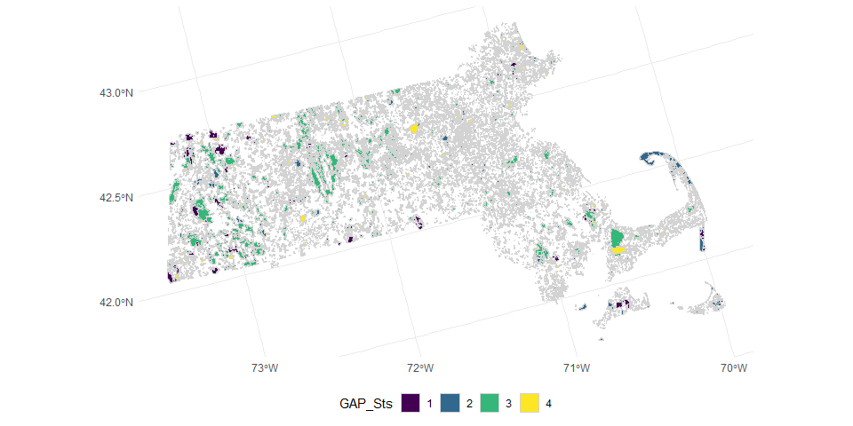
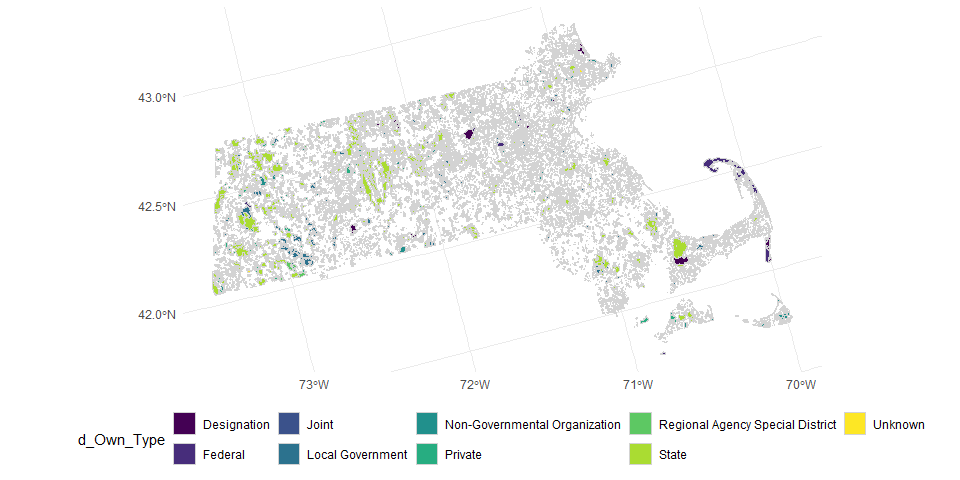
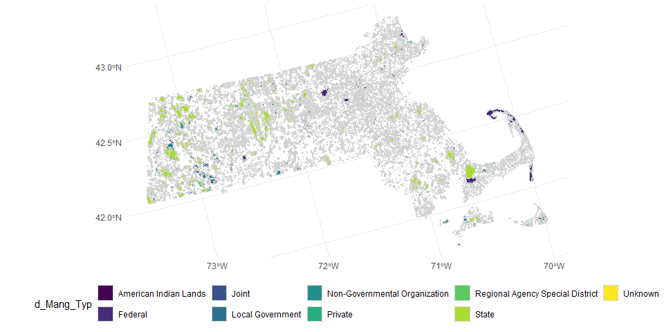
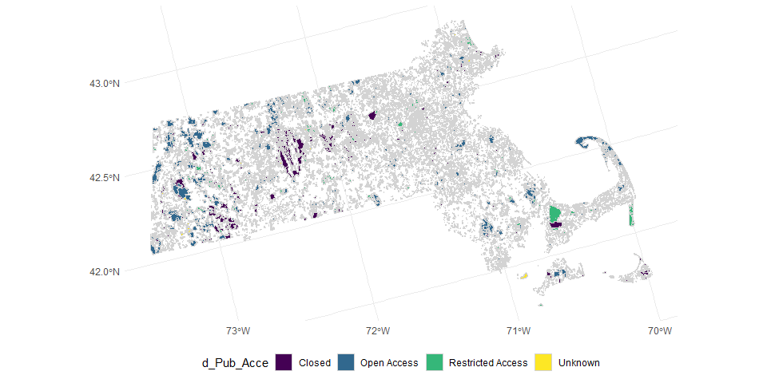
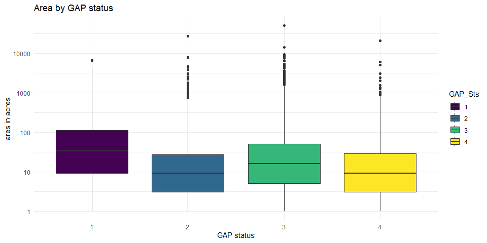
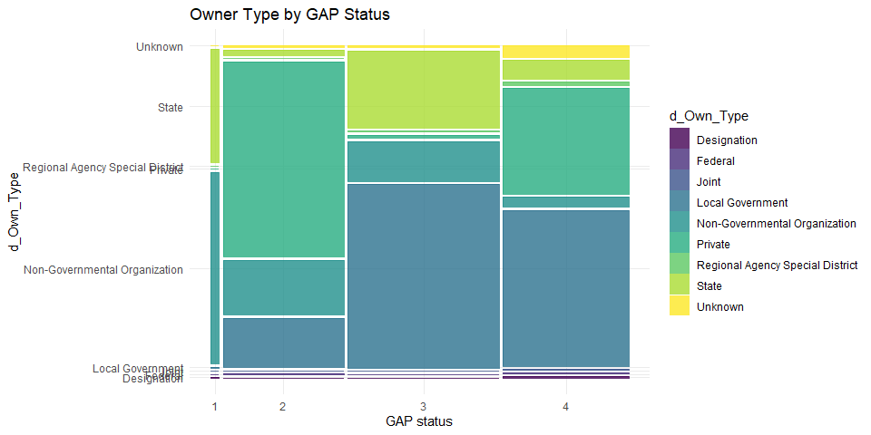
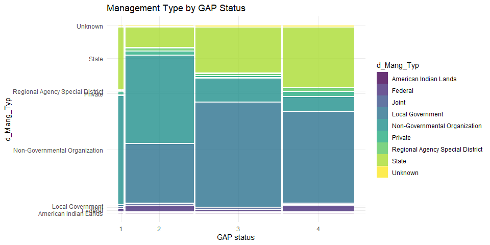
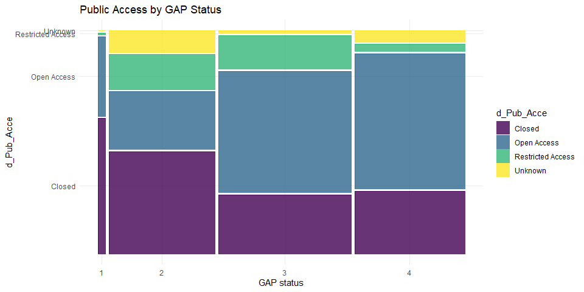

Land Protection Status in Massachuetts
================
Juliane Manitz
18 November, 2024

<!-- ## Libraries and settings -->

## Background: 30x30 goal

The [30x30 goal](https://www.campaignfornature.org/Background) is a
global conservation initiative aimed at protecting 30% of the planet’s
land and oceans by 2030. It seeks to safeguard biodiversity, mitigate
climate change, and promote ecosystem resilience by preserving critical
habitats and ecosystems. Endorsed by numerous countries, including the
United States, and environmental organizations, the goal aims to halt
the rapid loss of nature, restore degraded environments, and support
Indigenous and local communities whose livelihoods depend on healthy
ecosystems. By setting this target, 30x30 hopes to ensure long-term
sustainability and environmental health for future generations.

<!--30x30 goal: protect at least 30% of terrestrial and inland water and at least 30% of coastal and marine areas by 2030 as globally agreed by the Convention on Biological Diversity in the Kunming-Montreal Post-2020 Global Biodiversity Framework. [Source: https://www.campaignfornature.org/Background] -->

[Rosa and Malcom (2020)](https://doi.org/10.17605/OSF.IO/2PRDY)
performed a multi-scale analyses that compares protected area GAP
status, endangered species richness, and carbon sequestration potential.
Their analysis demonstrates that 30x30 is numerically achievable
nationally, but high spatial heterogeneity highlights the need for
tailored approaches from a mix of authorities at federal, regional and
state scales.

<!--Source: Lindsay Rosa, Ph.D; Jacob Malcom, Ph.D; Center for Conservation Innovation, Defenders of Wildlife: GETTING TO 30X30: Guidelines for Decision-makers [https://defenders-cci.org/publication/30x30-report/; https://doi.org/10.17605/OSF.IO/2PRDY; July 2020] -->

## Massachuetts Map

Source: U.S. Geological Survey (USGS) Gap Analysis Project (GAP), 2022,
Protected Areas Database of the United States (PAD-US) 3.0: U.S.
Geological Survey data release, <https://doi.org/10.5066/P9Q9LQ4B>.

Only GAP 1 and 2 are typically considered protected. However, GAP 3
areas are governed under multipleuse mandates (e.g., wildlife, forestry
and mining) and may have particular potential to advance biodiversity
and climate protections more quickly through administrative mechanisms
([Rosa and Malcom, 2020)](https://doi.org/10.17605/OSF.IO/2PRDY).

``` r
map <- st_read("map_data/PADUS3_0Combined_StateMA.shp")
```

    ## Reading layer `PADUS3_0Combined_StateMA' from data source 
    ##   `C:\Users\navne\OneDrive\Desktop\Jule\Documents\climate_projects\biodiversity_mass\map_data\PADUS3_0Combined_StateMA.shp' 
    ##   using driver `ESRI Shapefile'
    ## Simple feature collection with 26347 features and 45 fields
    ## Geometry type: MULTIPOLYGON
    ## Dimension:     XY
    ## Bounding box:  xmin: 1830830 ymin: 2302826 xmax: 2137684 ymax: 2477959
    ## Projected CRS: USA_Contiguous_Albers_Equal_Area_Conic_USGS_version

``` r
map_dt <- map %>% st_drop_geometry() 
```

### GAP status

``` r
#GAP_Sts # GAP status
ggplot(data = map) + geom_sf(aes(fill = GAP_Sts), color="lightgrey") + 
  scale_fill_viridis(discrete = TRUE) +
  theme_minimal() + theme(legend.position = "bottom")
```

<!-- -->

``` r
map_dt %>% group_by(GAP_Sts) %>% 
  summarize(pct = sum(GIS_Acres) %>% calc_prop()) %>% #arrange(desc(pct)) %>% 
  gt() %>% fmt_number("pct")
```

</style>
<table class="gt_table" data-quarto-disable-processing="false" data-quarto-bootstrap="false">
  <thead>
    <tr class="gt_col_headings">
      <th class="gt_col_heading gt_columns_bottom_border gt_right" rowspan="1" colspan="1" scope="col" id="GAP_Sts">GAP_Sts</th>
      <th class="gt_col_heading gt_columns_bottom_border gt_right" rowspan="1" colspan="1" scope="col" id="pct">pct</th>
    </tr>
  </thead>
  <tbody class="gt_table_body">
    <tr><td headers="GAP_Sts" class="gt_row gt_right">1</td>
<td headers="pct" class="gt_row gt_right">1.75</td></tr>
    <tr><td headers="GAP_Sts" class="gt_row gt_right">2</td>
<td headers="pct" class="gt_row gt_right">4.20</td></tr>
    <tr><td headers="GAP_Sts" class="gt_row gt_right">3</td>
<td headers="pct" class="gt_row gt_right">11.32</td></tr>
    <tr><td headers="GAP_Sts" class="gt_row gt_right">4</td>
<td headers="pct" class="gt_row gt_right">3.75</td></tr>
  </tbody>
  &#10;  
</table>
</div>

### Owners Type

``` r
#d_Own_Type #Owners Type
ggplot(data = map) + geom_sf(aes(fill = d_Own_Type), color="lightgrey") + 
  scale_fill_viridis(discrete = TRUE) +
  theme_minimal() + theme(legend.position = "bottom")
```

<!-- -->

``` r
map_dt %>% group_by(d_Own_Type) %>% 
  summarize(pct = sum(GIS_Acres) %>% calc_prop()) %>%
  arrange(desc(pct)) #%>% gt() %>% fmt_number("pct")
```

    ## # A tibble: 9 × 2
    ##   d_Own_Type                            pct
    ##   <chr>                               <dbl>
    ## 1 State                            8.76    
    ## 2 Local Government                 5.04    
    ## 3 Private                          3.42    
    ## 4 Non-Governmental Organization    1.75    
    ## 5 Federal                          0.845   
    ## 6 Designation                      0.793   
    ## 7 Unknown                          0.276   
    ## 8 Regional Agency Special District 0.129   
    ## 9 Joint                            0.000385

### Management Type

``` r
#d_Mang_Typ #Management Type
ggplot(data = map) + geom_sf(aes(fill = d_Mang_Typ), color="lightgrey") + 
  scale_fill_viridis(discrete = TRUE) +
  theme_minimal() + theme(legend.position = "bottom")
```

<!-- -->

``` r
map_dt %>% group_by(d_Mang_Typ) %>% 
  summarize(pct = sum(GIS_Acres) %>% calc_prop()) %>%
  arrange(desc(pct)) #%>% gt() %>% fmt_number("pct")
```

    ## # A tibble: 9 × 2
    ##   d_Mang_Typ                             pct
    ##   <chr>                                <dbl>
    ## 1 State                            10.7     
    ## 2 Local Government                  5.02    
    ## 3 Non-Governmental Organization     2.93    
    ## 4 Federal                           2.05    
    ## 5 Regional Agency Special District  0.142   
    ## 6 Private                           0.129   
    ## 7 American Indian Lands             0.0121  
    ## 8 Unknown                           0.00902 
    ## 9 Joint                             0.000385

<!-- 
### Designation Type
&#10;
``` r
#d_Des_Tp #Designation Type
ggplot(data = map) + geom_sf(aes(fill = d_Des_Tp), color="lightgrey") + 
  scale_fill_viridis(discrete = TRUE) +
  theme_minimal() + theme(legend.position = "bottom")
&#10;map_dt %>% group_by(d_Des_Tp) %>% 
  summarize(sum = sum(GIS_Acres) %>% calc_prop()) %>% gt()
```
-->

### Public access

``` r
#d_Pub_Acce # Public access
ggplot(data = map) + geom_sf(aes(fill = d_Pub_Acce), color="lightgrey") + 
  scale_fill_viridis(discrete = TRUE) +
  theme_minimal() + theme(legend.position = "bottom")
```

<!-- -->

``` r
map_dt %>% group_by(d_Pub_Acce) %>% 
  summarize(pct = sum(GIS_Acres) %>% calc_prop()) %>%
  arrange(desc(pct)) #%>% gt() %>% fmt_number("pct")
```

    ## # A tibble: 4 × 2
    ##   d_Pub_Acce           pct
    ##   <chr>              <dbl>
    ## 1 Open Access       10.1  
    ## 2 Closed             7.16 
    ## 3 Restricted Access  3.18 
    ## 4 Unknown            0.531

## Proportion of Protected Land in Massachuetts

In Massachusetts, only about 5% of the land and 1.5% of the ocean are
protected from logging and mining, a far cry from the 30% nationwide
pledge.

Massachuetts protected areas (GAP 1+2 = 5.6%) and GAP3 = 11.2%, most is
under state management \[Source: United States Geological Survey (USGS)
Protected Areas Database of the United States (PAD-US)
<https://maps.usgs.gov/padusdataexplorer/#/protected-areas>\]

``` r
# GAP 1+2
map %>% st_drop_geometry() %>% filter(GAP_Sts < 3) %>% 
  summarize(sum = sum(GIS_Acres)) %>% calc_prop()
```

    ## [1] 5.94312

``` r
# GAP 1-3
map %>% st_drop_geometry() %>% filter(GAP_Sts < 4) %>% 
  summarize(sum = sum(GIS_Acres)) %>% calc_prop()
```

    ## [1] 17.26516

## More details

<!-- 
boxplot Variation of GIS_Acres by GAP
Table GAP vs public access and other factors
-->

``` r
map_dt %>% 
  ggplot(aes(y=GIS_Acres, x=GAP_Sts, fill = GAP_Sts)) + 
  geom_boxplot() + scale_y_log10() + 
  labs(title = "Area by GAP status", y="ares in acres", x="GAP status") + 
  scale_fill_viridis(discrete = TRUE) + theme_minimal()
```

<!-- -->

``` r
ggplot(data = map_dt) +
  geom_mosaic(aes(x = product(d_Own_Type, GAP_Sts), fill=d_Own_Type)) + 
  labs(title='Owner Type by GAP Status', x="GAP status") + 
  scale_fill_viridis(discrete = TRUE) + theme_minimal()
```

<!-- -->

``` r
ggplot(data = map_dt) +
  geom_mosaic(aes(x = product(d_Mang_Typ, GAP_Sts), fill=d_Mang_Typ)) + 
  labs(title='Management Type by GAP Status', x="GAP status") + 
  scale_fill_viridis(discrete = TRUE) + theme_minimal()
```

<!-- -->

``` r
ggplot(data = map_dt) +
  geom_mosaic(aes(x = product(d_Pub_Acce, GAP_Sts), fill=d_Pub_Acce)) + 
  labs(title='Public Access by GAP Status', x="GAP status") + 
  scale_fill_viridis(discrete = TRUE) + theme_minimal()
```

<!-- -->

## Pending Action by Massachuetts Government

Healey establishes biodiversity goals with (executive
order)\[<https://www.mass.gov/news/governor-healey-celebrates-climate-week-by-establishing-nations-first-long-term-biodiversity-goals-single-use-plastic-bottle-ban>\],
which directs the state to develop biodiversity goals for 2030, 2040,
and 2050. The [administration
celebrates](https://www.wbur.org/news/2023/09/21/massachusetts-conservation-biodiversity)
itselves, because Massachusetts is the first state to set metrics out to
2050, and the first on the East Coast to include coastal and marine
biodiversity. However, the deadline to make a plan was missed.

Moreover, Healey did not renew logging moratorium on state land, which
[expired Jan 5th,
2024](https://www.nepm.org/regional-news/2024-01-05/massachusetts-issues-climate-forestry-report-ends-tree-cutting-pause-loggers-want-work-to-begin).
She was critized as it did not allow “climate-smart”
management/interventions.

# Session Information (for Reproducibility)

``` r
print(sessionInfo(), locale = FALSE)
```

    ## R version 4.4.1 (2024-06-14 ucrt)
    ## Platform: x86_64-w64-mingw32/x64
    ## Running under: Windows 11 x64 (build 22621)
    ## 
    ## Matrix products: default
    ## 
    ## 
    ## attached base packages:
    ## [1] stats     graphics  grDevices utils     datasets  methods   base     
    ## 
    ## other attached packages:
    ## [1] gt_0.11.0         ggmosaic_0.3.3    viridis_0.6.5     viridisLite_0.4.2
    ## [5] ggplot2_3.5.1     dplyr_1.1.4       sf_1.0-17        
    ## 
    ## loaded via a namespace (and not attached):
    ##  [1] sass_0.4.9         tidyr_1.3.1        plotly_4.10.4      utf8_1.2.4        
    ##  [5] generics_0.1.3     productplots_0.1.1 xml2_1.3.6         class_7.3-22      
    ##  [9] KernSmooth_2.23-24 digest_0.6.37      magrittr_2.0.3     evaluate_1.0.1    
    ## [13] grid_4.4.1         fastmap_1.2.0      plyr_1.8.9         jsonlite_1.8.8    
    ## [17] ggrepel_0.9.6      e1071_1.7-14       DBI_1.2.3          gridExtra_2.3     
    ## [21] httr_1.4.7         purrr_1.0.2        fansi_1.0.6        scales_1.3.0      
    ## [25] lazyeval_0.2.2     cli_3.6.3          rlang_1.1.4        units_0.8-5       
    ## [29] munsell_0.5.1      withr_3.0.1        yaml_2.3.10        tools_4.4.1       
    ## [33] colorspace_2.1-1   vctrs_0.6.5        R6_2.5.1           proxy_0.4-27      
    ## [37] lifecycle_1.0.4    classInt_0.4-10    htmlwidgets_1.6.4  pkgconfig_2.0.3   
    ## [41] pillar_1.9.0       gtable_0.3.5       glue_1.7.0         data.table_1.16.0 
    ## [45] Rcpp_1.0.13        highr_0.11         xfun_0.47          tibble_3.2.1      
    ## [49] tidyselect_1.2.1   rstudioapi_0.16.0  knitr_1.48         farver_2.1.2      
    ## [53] htmltools_0.5.8.1  rmarkdown_2.28     compiler_4.4.1
