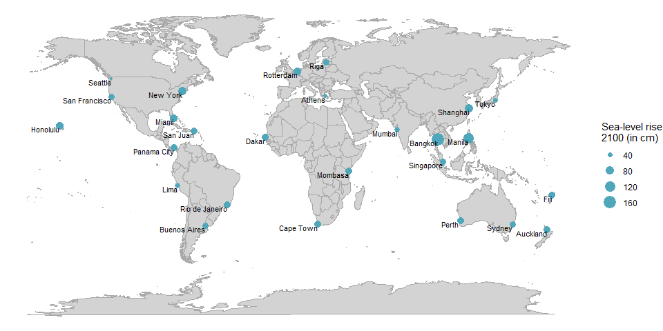

Sea-Level Projection 2100
================
Juliane Manitz
02 December, 2024

<!-- ## Libraries and settings -->

## Background: Sea Level Rise

Sea Level Rise is a central variable in climate data science. Monitoring
sea level is critical for assessing the impacts of melting glaciers and
polar ice caps, and thermal expansion of water due to warming. This is
key for predicting coastal flooding and erosion risks. Projections under
different scenarios based on the assessment presented in the IPCC Sixth
Assessment Report are available in the NASA sea level projection tool.

## Sea-Level Projection Data

Assuming intermediate GHG emissions (SSP2-4.5, CO2 emissions around
current levels until 2050, then falling but not reaching net zero by
2100), we can expect a sea-level rise of between 43 and 76 cm (17 -
30in), although the exact amount depends on several factors, such as ice
sheet dynamics and regional variations.

Source: <https://sealevel.nasa.gov/ipcc-ar6-sea-level-projection-tool>

``` r
# Load sea-level data
dt <- read.csv("sea-level-projection-data.csv", skip=3)
# Add geo location to the dataset
#ggmap::register_google(key="xxx", write =TRUE)
dt[c("lon","lat")] <- ggmap::geocode(dt$location)
```

    ## Warning: "Lima" not uniquely geocoded, using "lima, peru"

    ## Warning: "Rio de Janeiro" not uniquely geocoded, using "rio de janeiro, state of rio de
    ## janeiro, brazil"

    ## Warning: "Manila" not uniquely geocoded, using "manila, metro manila,
    ## philippines"

## Plot World Map

``` r
# World map data
world <- map_data("world")

ggplot() + 
  geom_polygon(data = world,  aes(long, lat, group = group),
               color = "darkgrey", fill = "lightgrey", linewidth=0.1) + 
  geom_point(data=dt, aes(lon, lat, size=sea_level_proj), color="#50A7BA") +
  geom_text(data=dt, aes(lon, lat, label=location), hjust=1, vjust=1, size=3) +
  theme_void() + labs(size = "Sea-level rise\n2100 (in cm)")
```

<!-- -->

## Session Information (for Reproducibility)

``` r
print(sessionInfo(), locale = FALSE)
```

    ## R version 4.4.1 (2024-06-14 ucrt)
    ## Platform: x86_64-w64-mingw32/x64
    ## Running under: Windows 11 x64 (build 22621)
    ## 
    ## Matrix products: default
    ## 
    ## 
    ## attached base packages:
    ## [1] stats     graphics  grDevices utils     datasets  methods   base     
    ## 
    ## other attached packages:
    ##  [1] ggmap_4.0.0     lubridate_1.9.3 forcats_1.0.0   stringr_1.5.1  
    ##  [5] dplyr_1.1.4     purrr_1.0.2     readr_2.1.5     tidyr_1.3.1    
    ##  [9] tibble_3.2.1    ggplot2_3.5.1   tidyverse_2.0.0
    ## 
    ## loaded via a namespace (and not attached):
    ##  [1] utf8_1.2.4        generics_0.1.3    bitops_1.0-8      jpeg_0.1-10      
    ##  [5] stringi_1.8.4     hms_1.1.3         digest_0.6.37     magrittr_2.0.3   
    ##  [9] evaluate_1.0.1    grid_4.4.1        timechange_0.3.0  fastmap_1.2.0    
    ## [13] maps_3.4.2.1      plyr_1.8.9        jsonlite_1.8.8    httr_1.4.7       
    ## [17] fansi_1.0.6       scales_1.3.0      cli_3.6.3         rlang_1.1.4      
    ## [21] munsell_0.5.1     withr_3.0.1       yaml_2.3.10       tools_4.4.1      
    ## [25] tzdb_0.4.0        colorspace_2.1-1  curl_5.2.2        vctrs_0.6.5      
    ## [29] R6_2.5.1          png_0.1-8         lifecycle_1.0.4   pkgconfig_2.0.3  
    ## [33] pillar_1.9.0      gtable_0.3.5      glue_1.7.0        Rcpp_1.0.13      
    ## [37] highr_0.11        xfun_0.47         tidyselect_1.2.1  rstudioapi_0.16.0
    ## [41] knitr_1.48        farver_2.1.2      htmltools_0.5.8.1 labeling_0.4.3   
    ## [45] rmarkdown_2.28    compiler_4.4.1
