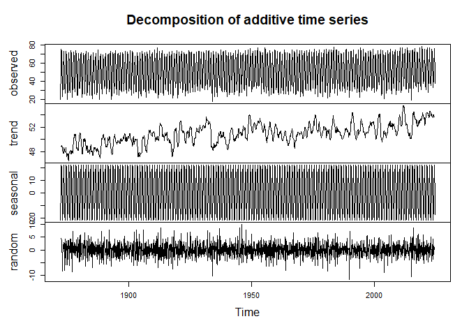
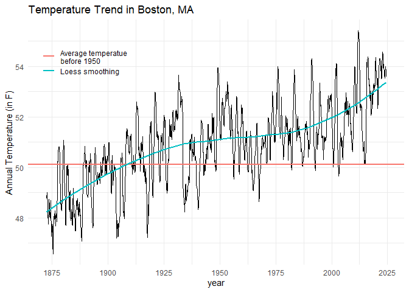
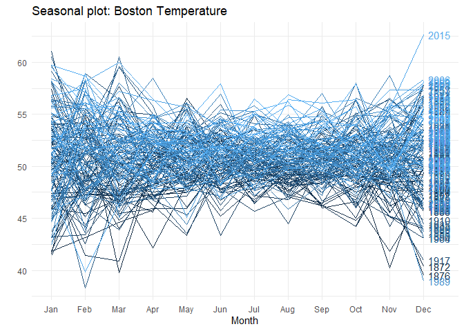
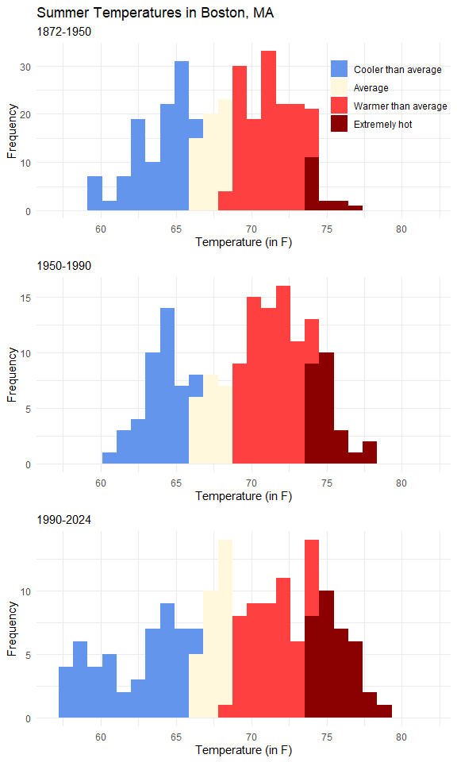

Average Temperature in Boston
================
Juliane Manitz
11 November, 2024

## Load Data

NOWData - NOAA Online Weather Data. Monthly summarized data calculates
averages, totals, daily extremes or frequencies for the selected
variable for each month of the year for the selected range of years.
Note: trace precipition/snowfall/snow depth amounts are treated as zero
in sums, mean, and number of days counts. Annual average temperatures
are the average of the twelve monthly values. Temperatures are reported
in degrees F; precipitation, snowfall and snow depth are reported in
inches. Source: <https://www.weather.gov/wrh/Climate?wfo=box>

``` r
# To load all sheets in a workbook, use lapply()
path <- "Temp_Boston.xlsx"
dt_list <- map(excel_sheets(path), read_excel, path = path, skip=2)
names(dt_list) <- excel_sheets(path)

# Data preprocessing
dt_list2 <- lapply(names(dt_list), function(x)
  dt_list[[x]] %>%  
    mutate_if(is.character, list(~na_if(., "M") %>% na_if(., "T") %>% as.numeric)) %>%
    pivot_longer(-Year, names_to = "Month", values_to = x)
)

# Combine list into one dataset
dt <- Reduce(left_join, dt_list2)
```

    ## Joining with `by = join_by(Year, Month)`
    ## Joining with `by = join_by(Year, Month)`
    ## Joining with `by = join_by(Year, Month)`

``` r
# Separate Annual averages from monthly values
dtY <- dt %>% filter(Month == "Annual")
dtM <- dt %>% filter(Month != "Annual") %>% 
  mutate(date = paste0("01-",tolower(Month),"-",Year) %>% as.Date(format = "%d-%b-%Y"))

# Save data 
save(dtY, dtM, file = "TempBostonTS.RData")
```

## Time Series of Average Temperature in Boston, MA

Temperature is one of the most critical indicators of the climate
crisis. Climate scientists track global, regional, and local temperature
trends over time, focusing on surface temperatures, sea surface
temperatures (SST), and atmospheric temperatures at various altitudes.

In this example, we study the average temperature in Boston MA, which
has been recorded since 1872. We decompose the time series into trend,
seasonality and random error term.

``` r
#load("TempBostonTS.RData")

ts_decomposed <- dtM %>% select(meanTemp) %>% 
  # Create time-series objects with freq 12 => Monthly data.
  stats::ts(frequency = 12, start = c(1872, 1)) %>% 
  # Missing value imputation by Kalman smoothing
  imputeTS::na_kalman() %>% 
  # Decompose a time series into seasonal, trend and error
  decompose(type = "additive")
```

    ## Registered S3 method overwritten by 'quantmod':
    ##   method            from
    ##   as.zoo.data.frame zoo

``` r
plot(ts_decomposed)
```

<!-- -->

We look in more detail into the trend component of the time series. For
reference, we add the mean temperature before 1950 and the locally
estimated smoothed trend.

``` r
# Calculate mean Temperature before 1950
ref1950 = dtM %>% filter(Year<1950) %>% summarize(mean(meanTemp, na.rm=TRUE)) %>% pull()

# Plot time series trend component 
data.frame(trend=ts_decomposed$trend, date=time(ts_decomposed$x)) %>% 
  ggplot(aes(x=date, y=trend)) + geom_line() + 
  # Add reference: mean temperature before 1950
  geom_hline(aes(color = "Average temperatue\nbefore 1950", yintercept = ref1950), size = 1) + 
  # Add loess smoothed trend
  stat_smooth(aes(color = "Loess smoothing"), method = "loess", se=FALSE) +
  scale_x_continuous(breaks=seq(1850, 2025, 25)) + 
  labs(x="year", y="Annual Temperature (in F)", title="Temperature Trend in Boston, MA", color="") +
  theme_minimal() + theme(legend.position = c(.15,.85))
```

    ## Warning: Using `size` aesthetic for lines was deprecated in ggplot2 3.4.0.
    ## ℹ Please use `linewidth` instead.
    ## This warning is displayed once every 8 hours.
    ## Call `lifecycle::last_lifecycle_warnings()` to see where this warning was
    ## generated.

    ## Warning: A numeric `legend.position` argument in `theme()` was deprecated in ggplot2
    ## 3.5.0.
    ## ℹ Please use the `legend.position.inside` argument of `theme()` instead.
    ## This warning is displayed once every 8 hours.
    ## Call `lifecycle::last_lifecycle_warnings()` to see where this warning was
    ## generated.

    ## `geom_smooth()` using formula = 'y ~ x'

    ## Warning: Removed 12 rows containing non-finite outside the scale range
    ## (`stat_smooth()`).

    ## Warning: Removed 12 rows containing missing values or values outside the scale range
    ## (`geom_line()`).

<!-- -->

De-seasonalizing throws insight about the seasonal pattern in the time
series and helps to model the data without the seasonal effects.

``` r
# De-seasonalized time series
ts_deseasonalized <- forecast::seasadj(ts_decomposed)  # de-seasonalize
forecast::ggseasonplot(ts_deseasonalized, s = 12, main="Seasonal plot: Boston Temperature",  continuous=TRUE, year.labels=TRUE) + theme_minimal()
```

    ## Warning in forecast::ggseasonplot(ts_deseasonalized, s = 12, main = "Seasonal
    ## plot: Boston Temperature", : Provided season.labels have length 1, but 12 are
    ## required. Ignoring season.labels.

<!-- -->

## Summer Temperature Shift

``` r
# Define bins for coloring based on early data < 1950
cols <-c("cornflowerblue","cornsilk","brown1","darkred") 
cc <- dtM %>% filter(Month %in% c("Jun","Jul","Aug","Sep") & Year < 1950) %>% 
  pull(meanTemp) %>% quantile(probs =c(.325,.5,.95))
dtM %<>% mutate(meanTempC = factor(cut(meanTemp, breaks = c(0,cc,120)), 
                labels=c("Cooler than average", "Average", "Warmer than average", "Extremely hot")))
```

``` r
p1 <- dtM %>% 
  filter(Month %in% c("Jun","Jul","Aug", "Sep") & Year < 1950) %>% 
  ggplot(aes(meanTemp, fill = meanTempC)) + scale_fill_manual(values = cols) + 
  geom_histogram(bins = 27, show.legend = TRUE) +
  labs(y="Frequency", x="Temperature (in F)", 
       title="Summer Temperatures in Boston, MA", subtitle = "1872-1950", fill="") +
  scale_x_continuous(limits = c(57,82), breaks=seq(50,120, 5)) + 
  theme_minimal() + theme(legend.position = c(0.85,0.75))

p2 <- dtM %>% 
  filter(Month %in% c("Jun","Jul","Aug", "Sep") & Year < 1990 & Year > 1950) %>% 
  ggplot(aes(meanTemp, fill = meanTempC)) + scale_fill_manual(values = cols) + 
  geom_histogram(bins = 27, show.legend = FALSE) +
  labs(y="Frequency", x="Temperature (in F)", subtitle = "1950-1990", fill="") +
  scale_x_continuous(limits = c(57,82), breaks=seq(50,120, 5)) + 
  theme_minimal() 

p3 <- dtM %>% 
  filter(Month %in% c("May","Jun","Jul","Aug", "Sep") & Year > 1990) %>% 
  ggplot(aes(meanTemp, fill = meanTempC)) + scale_fill_manual(values = cols) + 
  geom_histogram(bins = 27, show.legend = FALSE) +
  labs(y="Frequency", x="Temperature (in F)", subtitle="1990-2024", fill="") +
  scale_x_continuous(limits = c(57,82), breaks=seq(50,120, 5)) + 
  theme_minimal() 

grid.arrange(p1,p2,p3,ncol=1)
```

<!-- -->

## Session Information (for Reproducibility)

``` r
print(sessionInfo(), locale = FALSE)
```

    ## R version 4.4.1 (2024-06-14 ucrt)
    ## Platform: x86_64-w64-mingw32/x64
    ## Running under: Windows 11 x64 (build 22621)
    ## 
    ## Matrix products: default
    ## 
    ## 
    ## attached base packages:
    ## [1] stats     graphics  grDevices utils     datasets  methods   base     
    ## 
    ## other attached packages:
    ## [1] viridis_0.6.5     viridisLite_0.4.2 ggplot2_3.5.1     gridExtra_2.3    
    ## [5] magrittr_2.0.3    purrr_1.0.2       tidyr_1.3.1       readxl_1.4.3     
    ## [9] dplyr_1.1.4      
    ## 
    ## loaded via a namespace (and not attached):
    ##  [1] utf8_1.2.4        generics_0.1.3    xml2_1.3.6        lattice_0.22-6   
    ##  [5] digest_0.6.37     evaluate_1.0.1    grid_4.4.1        fastmap_1.2.0    
    ##  [9] Matrix_1.7-0      cellranger_1.1.0  nnet_7.3-19       ggtext_0.1.2     
    ## [13] forecast_8.23.0   mgcv_1.9-1        fansi_1.0.6       scales_1.3.0     
    ## [17] cli_3.6.3         crayon_1.5.3      rlang_1.1.4       splines_4.4.1    
    ## [21] munsell_0.5.1     withr_3.0.1       yaml_2.3.10       tools_4.4.1      
    ## [25] parallel_4.4.1    colorspace_2.1-1  curl_5.2.2        vctrs_0.6.5      
    ## [29] R6_2.5.1          zoo_1.8-12        lifecycle_1.0.4   tseries_0.10-58  
    ## [33] urca_1.3-4        pkgconfig_2.0.3   pillar_1.9.0      gtable_0.3.5     
    ## [37] glue_1.7.0        quantmod_0.4.26   Rcpp_1.0.13       stinepack_1.5    
    ## [41] highr_0.11        xfun_0.47         tibble_3.2.1      lmtest_0.9-40    
    ## [45] tidyselect_1.2.1  rstudioapi_0.16.0 knitr_1.48        farver_2.1.2     
    ## [49] imputeTS_3.3      nlme_3.1-164      htmltools_0.5.8.1 labeling_0.4.3   
    ## [53] rmarkdown_2.28    xts_0.14.1        timeDate_4032.109 fracdiff_1.5-3   
    ## [57] compiler_4.4.1    quadprog_1.5-8    TTR_0.24.4        gridtext_0.1.5
